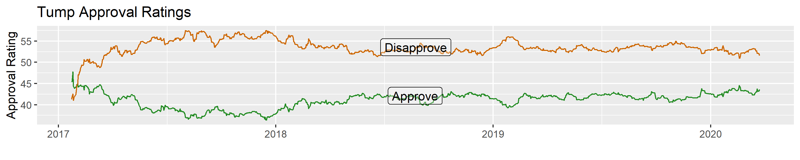

```{r setup, include=FALSE}
library(tidyverse)
library(crosstalk)
library(flexdashboard)
library(plotly)
library(summarywidget)
library(DT)
library(leaflet)
```

```{r}
sw_eye <- starwars %>% 
  filter(eye_color == str_extract(eye_color, "\\w+")) %>% 
  filter(eye_color != "unknown", 
         eye_color != "hazel", 
         eye_color != "white") %>% 
  filter(mass < 200) %>% 
  mutate(eye_color = fct_infreq(eye_color)) %>% 
  mutate(species = fct_rev(fct_infreq(species)))

sw_eye_levels <- levels(sw_eye$eye_color)

shared_sw_eye <- SharedData$new(sw_eye)
```

```{r}
scatter <- plot_ly(data = shared_sw_eye, x = ~mass, y = ~height, 
        color = ~eye_color, colors = sw_eye_levels,
        text = ~name, mode = "markers")   %>% 
  layout(title = "Mass by Height + Eye Color")
```


Star Wars Characters
=============================================================

Sidebar1 {.sidebar}
-----------------------------------------------------------------------

```{r}
filter_slider("height", "Height", shared_sw_eye, ~height)
filter_select("hair", "Hair Color", shared_sw_eye, ~hair_color)
filter_select("shortspecies", "Select Species", shared_sw_eye, ~species)
filter_checkbox("sw_eye_levels", "Eye Color", shared_sw_eye, ~eye_color, columns = 2)

```


`r summarywidget(shared_sw_eye, 'count', 'eye_color', selection=~eye_color=="black")` Characters with **Black Eyes**

<big>`r summarywidget(shared_sw_eye, statistic='count', column='eye_color')` Total Characters</big>


Column
-----------------------------------------------------------------------

### Chart A 

```{r}
scatter
```

> Data Source:  [dplyr::starwars](https://dplyr.tidyverse.org/reference/starwars.html)

Easy Plotly & Time Series
=========================================================

```{r}
trump <- read_csv("https://projects.fivethirtyeight.com/trump-approval-data/approval_topline.csv", 
                  col_types = cols(modeldate = col_date(format = "%m/%d/%Y"), 
                                   timestamp = col_datetime(format = "%H:%M:%S %d %b %Y ")))

trump_over_under <- trump %>% 
  filter(subgroup == "All polls") %>% 
  select(modeldate, approve_estimate, disapprove_estimate) %>%
  gather("pol_type", "score", -modeldate)
```


### via ggplot2

```{r ggplot_trump_score}
trump_over_under <- ggplot(trump_over_under, aes(x = modeldate, y = score, color = pol_type)) +
  geom_line() +
  scale_color_manual(values = c("forestgreen", "darkorange3"),
                     labels = c("Approve", "Disapprove")) +
  labs(x = "", y = "Approval Rating",
       color = "", title = "Tump Approval Ratings")

ggsave(width = 8, height = 1.6, dpi = 300, "trump_over_under.png")
```




###  Plotly via `ggplotly()`


```{r plottly_ggplot_trumpscore}
ggplotly(trump_over_under) 
```

>  Data Source:  https://fivethirtyeight.com


Hurricane Origins {data-icon="fa-map"}
===========================================================

```{r}
canes <- read_csv("data/hurricanes.csv") %>% 
  select(-order, -casualties, -`damage (mn)`) %>% 
  select(1, 2, 3, 4, 7, 10, 13, 11, 12, everything())

sd_canes <- SharedData$new(canes)

canes_map <- sd_canes %>% 
  leaflet(width = "100%") %>% 
  addTiles() %>% 
  addMarkers(lat = ~COUNTRY_LAT, 
             lng = ~COUNTRY_LON, 
             popup = ~storm)

canes_table <- datatable(sd_canes, extensions="Scroller", style="bootstrap", class="compact", width="100%",
    options=list(deferRender=TRUE, scrollY=300, scroller=TRUE))
```


Sidebar2 {.sidebar}
-----------------------------------------------------------------------

```{r}
filter_slider("peak", "Peak Wind Speed", sd_canes, column=~`peak wind`, step=10)
filter_checkbox("usafct", "US Landfall", sd_canes, ~`us affected`, inline = TRUE)
```


**Linked Brusing** is possible via the `crosstalk` library package:  `crosstalk::SharedData$new(df)`

Column
-----------------

###

```{r}
canes_map
```

### 

```{r}
canes_table
```

> Data Source:  [Practice Dataset](https://github.com/libjohn/workshop_dash_explore/blob/master/data/hurricanes.csv)

Exercises
==============================================================

###  

1. [Easy interactive](exercise_timeseries.html) ggplot2 via `plotlly::ggplotly()` **answers**

1. [Linked Brushing via Shared Data](exercise_crosstalk_map.html)  **answers**

1. [Putting it all together](exercise_all_together.html) (layouts, shared data, filters, gauges, value boxes)  **answers**

Animate
==============================================================

### gganimate -- Choropleth to Cartogram of population growth in Africa, 2005


> Another option is to annimate a plot.  We don't discuss that in this workshop, but you can look at the [gganimate](https://gganimate.com/) page to learn more.  Image Credit:  https://www.r-graph-gallery.com/cartogram/


Resources
=============================================================

Column {data-width="66%"}
-------------------------------------------------------------

###  Library Packages


#### Used in this Workshop

- `flexdashboard` [documentation](https://rmarkdown.rstudio.com/flexdashboard/) -- Manage dashboard layouts (includes gauges)
- `crosstalk` [documentation](https://rstudio.github.io/crosstalk/) -- Enables linked brushing i.e. shared data

    - **Compatible/Interactive** CrossTalk enabled HTML Widgets:
    - `plotly` -- (easies:  `ggpplotly(ggpplot_object)`)
    - `DT`  -- displays tabular data
    - `leaflet` -- shows maps
    - `summarywidget` (sum, mean, count, etc.)
    
- More [HTML Widgets](https://www.htmlwidgets.org/). For example: `dygraphs` for time series, plus a whole passel of other widgets in the [gallery](http://gallery.htmlwidgets.org/)

#### See Also

[Storyboards](https://beta.rstudioconnect.com/jjallaire/htmlwidgets-showcase-storyboard/htmlwidgets-showcase-storyboard.html) and other [gallery examples](https://rmarkdown.rstudio.com/flexdashboard/examples.html) by Flexdashboards


#### Books (Online Documentation)

[_Plotly for R_](https://plotly-book.cpsievert.me/) by Carson Sievert

[_R Markdown_](https://bookdown.org/yihui/rmarkdown/): The Definitive Guide by Yihui Xie, J. J. Allaire, Garrett Grolemund.  Covering **Dashboards**: components, gauges, value boxes -- Chapter 5 ; **HTML Widgets** -- Chapter 16

### Box A

```{r}
eye_colors <- count(sw_eye %>% dplyr::distinct(eye_color)) 


valueBox(eye_colors, caption = "The subset of Star Wars characters consists of several distinct eye colors", icon="fa-eye", color = "rgb(224,102,255)")
```

Distinct Eye Colors

Column {data-width="33%"}
------------------------------------------------------

### Box 1

```{r}
valueBox(3, caption = "Value boxes deliver infographic gravitas", icon="fa-thumbs-up")
```


Packages

### Interactivity

```{r}
gauge("100", min = 0, max = 100, symbol = '%', gaugeSectors(
  success = c(80, 100), warning = c(40, 79), danger = c(0, 39)
))
```


### Simplity

```{r}
gauge(45, min = 0, max = 100, gaugeSectors(
  success = c(90, 100), warning = c(25, 89), danger = c(0, 24)
))
```

### Cost

```{r}
gauge(0, min = -1, max = 10, symbol = "$", gaugeSectors(
  success = c(0, 2), warning = c(3, 6), danger = c(7, 10)
))
```

> Gauges are visual!
